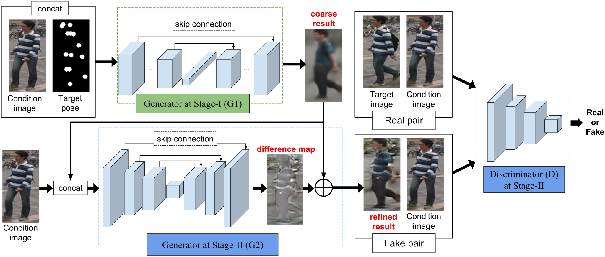

# Pose-Guided-Image-Generation
Implementation of NIPS 2017 paper [Pose Guided Person Image Generation](https://arxiv.org/abs/1705.09368) in PyTorch. 

## Pre-requisites
* Python 3.6
* PyTorch
* Scikit-Image
* Numpy
* Scipy

## Method
The key task is to transfer the appearance of a person from a given pose to a desired pose keeping the important appearance details intact. A two-stage approach is proposed to address the task, with each stage focusing on one aspect. The first stage comprises of pose integration generating a coarse image. The second stage utilizes a variant of a conditional DCGAN to fill in more appearance details.

## Network Architecture
The generation framework utilizes the pose information explicitly and consists of two key stages: pose integration and image
refinement. The architecture of generator is inspired by U-Net in both the key stages. In the first stage the condition image and the target pose are fed into the network to generate a coarse image of the person with the target pose. The second stage then refines the blurry result by training a generator in an adversarial way. The architecture of the generator and discriminator are shown below:



## Setup
* #### Clone the source code:
```
git clone https://github.com/harshitbansal05/Pose-Guided-Image-Generation/
cd Pose-Guided-Image-Generation
```
* #### Data preparation:
    1. Run `./run_prepare_data.sh`. It creates a `data` folder in the root directory and downloads the data from the author's [website](homes.esat.kuleuven.be/~liqianma/NIPS17_PG2/data/DF_img_pose.zip). It extracts the zip file and processes the images for the train and test data sets.
    2. It creates the folders `DF_train_data` and `DF_test_data` in the directory `data/DF_img_pose` for the train and test data sets respectively printing the count of both the sets at the end. 
* #### Training Steps:
    1. Run `./run_train_model.sh`. It performs the data preparation step if it has'nt been performed. The variable `gpu` in the script must be changed to -1 if the training process is carried on the cpu. Finally, training begins.
    2. It parses the namespaces present in the file `config.py` and those passed explicitly. It also imports the models from the file `models.py` and the PyTorch DataLoader from the file `data_loader.py`.
    3. It trains the two generators and the discriminator for a specified number of epochs, printing the loss at each step. It also periodically saves the generator and discriminator models in the directory specified by argument `checkpoint_dir` in the file `config.py`.

## Datasets
The DeepFashion (In-shop Clothes Retrieval Benchmark) dataset consists of 52,712 in-shop clothes images, and 200,000 cross-pose/scale pairs. All images are in high-resolution of 256×256. The entire dataset can be downloaded from [here](http://mmlab.ie.cuhk.edu.hk/projects/DeepFashion.html).

## Contributing
Suggestions and pull requests are actively welcome.

## References
1. Pose Guided Person Image Generation. ([Paper](https://arxiv.org/abs/1705.09368))
2. A TensorFlow Implementation of Pose Guided Person Image Generation. ([Link](https://github.com/charliememory/Pose-Guided-Person-Image-Generation))
